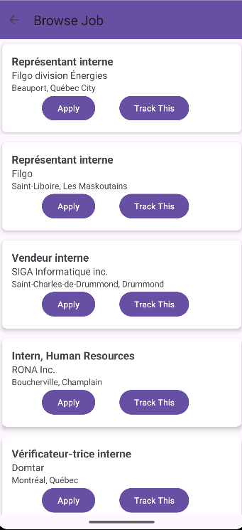
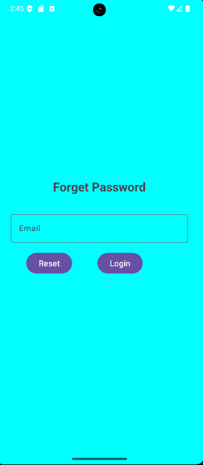
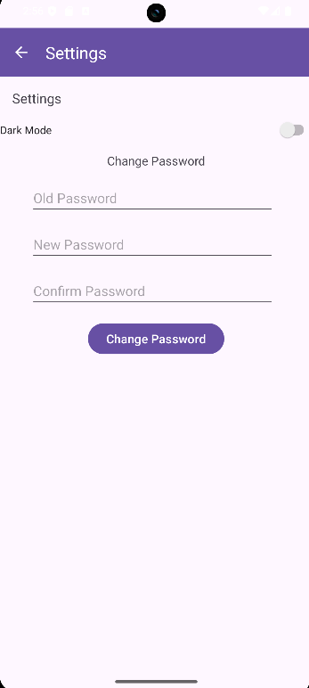
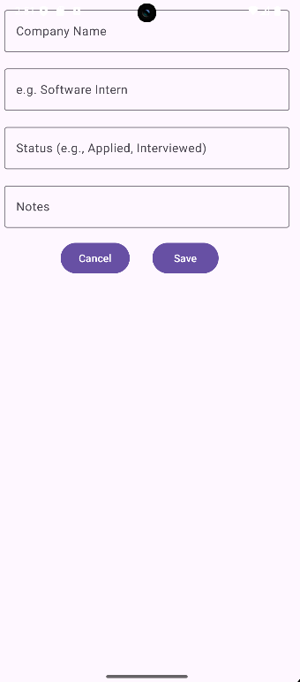
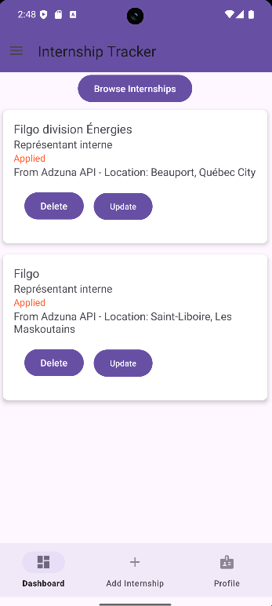

# Internship-Tracker
**Internship Tracker** is an Android app that helps students in Canada manage and find internship opportunities. It is built using **Java** and **Android Studio**, and uses **Firebase Firestore** and the **Adzuna API** to provide features like internship tracking and job browsing.  

# About the App   
This app is made to make internship searching and application tracking easier. Students can save details about the internships they applied to and also explore new internship listings in real-time. The job browsing part uses the Adzuna API to show Canadian internship directly inside the app.  
# Key Features
**Job Browsing:** Shows lists of internship from Adzuna and view them in a scrollable list.  

**User Authentication:** It allows users to register, login, change and reset their password using FirebaseAuth.  

   

    

    

   

**Internship Tracking:** It allows users to add, update, delete, and view internship applications saved in Firebase Firestore.  

    
  

**Settings:** It allows user to switch between dark and light mode, and change their password securely.    

   

# I used
**Java** - Core programming language.   
**Android Studio** - Development environment.     
**Firebase Firestore** - Cloud NoSQL database for storing users and internship data.   
**Firebase Authentication** - User login, registration, and password management.     
**Adzuna API** - Internship listing provider.   
## [View Latest Release](https://github.com/merci63/Internship-Tracker/releases)   

   
